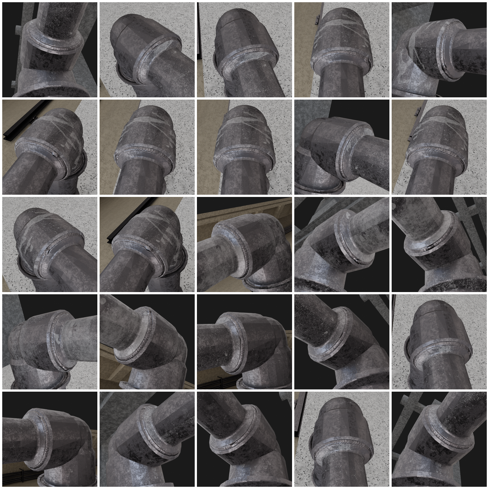
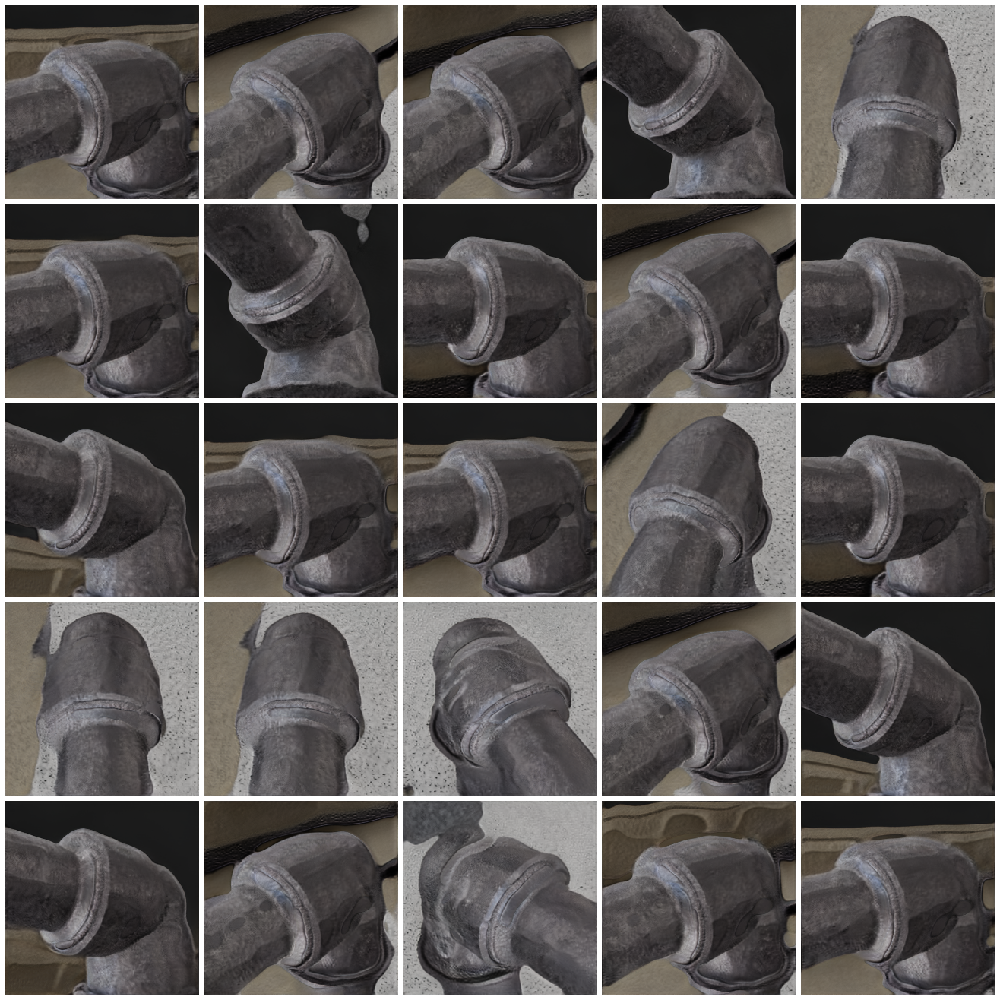
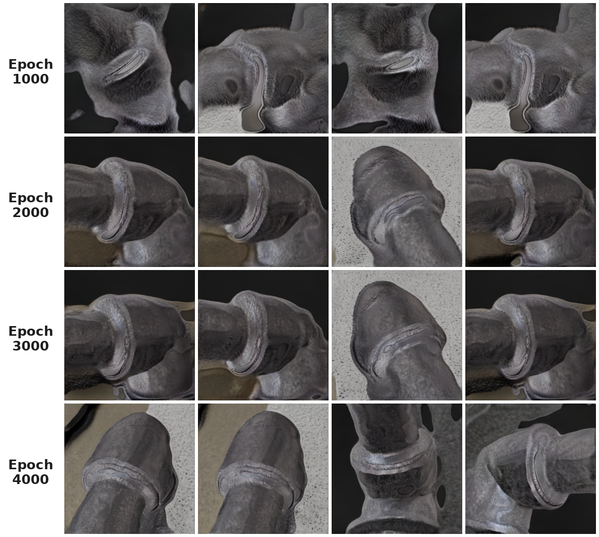

# StyleGAN2-ADA — Synthetic Welding-Defect Images

This is my working copy of StyleGAN2 with Adaptive Discriminator Augmentation
(ADA), which I use to grow small defect datasets when I don't have enough real
captures to train a classification model properly. The captures I actually use
for training at work don't carry much detail, so this time I wanted to push in
the opposite direction and see how far it would get on genuinely detailed imagery.

## What I was testing here

The images I threw at it come from the [MIAD dataset](https://miad-2022.github.io/),
specifically the **`metal_welding`** class: rendered pipe elbows with a welded
joint, shot from a lot of different angles and lit against changing backgrounds.
These are much richer than what I usually train on. There's fine metallic
texture, specular highlights on the pipe, the raised weld bead, floor speckle,
shadows. Plenty for the generator to get wrong.

The point of the exercise was simple: a stress test to see how far this
synthetic-image generation algorithm can actually go.

### The source data

A 5×5 sample straight from `metal_welding`:



### What the GAN produced

Same layout, all of these generated from a trained checkpoint:



### How it got there

You can watch it come together over training. Each row is four samples from the
same checkpoint, taken at 1000, 2000, 3000 and 4000 epochs:



Early on it's really just blobs with the right tonal range. By epoch 2000 the
elbow shape and the weld collar are clearly there, and from 3000 onward it's
mostly refining texture and sharpening the bead. The jump between 1000 and 2000
is the biggest one — after that it's diminishing returns, which is roughly what
I'd expect on a dataset this size.

## How it went

Honestly, better than I expected on the hard part. The generator picked up the
overall shape of the elbow joint, the weld bead running around the collar, the
brushed-metal texture and even the way the light catches the top of the pipe.
At a glance a lot of these would pass.

It's not perfect, and I'm not going to pretend otherwise. If you look at the
backgrounds you can still spot a faint horizontal banding near the top edge, and
every so often a small repeated smudge shows up on the pipe body — neither of
those exists in the original renders, so they're the model's own invention. My
read is that it's leftover augmentation leaking into the generator plus the usual
small-dataset overfitting; I caught it and dialed the augmentation back before
hitting the 4000-epoch mark, which is where I stopped — I'm not retraining beyond
that. Given how busy and complex the source samples are, the result is more than
adequate.

## Project structure

```
GAN_SyntheticData/
├── assets/
│   └── samples/              # images shown in this README
├── scripts/
│   ├── train.py
│   └── generate.py
├── stylegan2_ada/            # model code (config, training, layers, augment, ...)
├── dataset/                  # ← you create this: download MIAD (see Credits)
│   └── metal_welding/
├── stylegan2_checkpoints/    # ← created during training (not versioned)
├── generated_samples/        # ← created during generation (not versioned)
├── requirements.txt
├── pyproject.toml
├── LICENSE
└── README.md
```

The three folders marked `←` aren't tracked in git (they're in `.gitignore`).
`dataset/` is where you drop the MIAD images; the other two are produced
automatically when you train and generate.

## Running it

Grab the code and install the deps:

```bash
git clone https://github.com/tricio91/GAN_SyntheticData.git
cd GAN_SyntheticData

python -m venv .venv
source .venv/bin/activate
pip install -r requirements.txt
```

A CUDA GPU is basically a must. The defaults (256×256, batch 4) are sized for
about 8 GB of VRAM.

Your data goes in an `ImageFolder` layout, one folder per class:

```
dataset/
└── metal_welding/
    ├── 0000001.png
    └── ...
```

Train (it auto-resumes from `stylegan2_checkpoints/latest.pt` if it finds one):

```bash
python -m scripts.train \
    --data-dir dataset \
    --output-dir stylegan2_checkpoints \
    --epochs 4000
```

Generate once you've got a checkpoint:

```bash
python -m scripts.generate \
    --checkpoint-path stylegan2_checkpoints/latest.pt \
    --output-dir generated_samples \
    --num-samples 50 \
    --truncation-psi 0.6
```

If you want more variety at the cost of some fidelity, push `--truncation-psi`
toward `1.0`; for tighter, cleaner samples keep it around `0.5–0.7`.

## The parameters, and what each one actually does

These are the knobs worth knowing about. Defaults live in
`stylegan2_ada/config.py` and every one of them is exposed on the CLI.

| Parameter | Default | What it does |
| :-- | :-- | :-- |
| `img_size` | `256` | Output resolution. Must be a power of two. Each doubling adds a synthesis block, so you get more detail but memory and compute jump roughly 4×. |
| `batch_size` | `4` | Images per step. Keep it at 4 or higher — that's the group size the minibatch-stddev layer needs. Bigger batches train more smoothly if your VRAM allows. |
| `epochs` | `4000` | How long to train. With ~1000 images and batch 4 that's ~250 steps per epoch, so think in terms of images seen, not just the epoch count. |
| `lr_g` / `lr_d` | `0.0002` | Adam learning rates for generator and discriminator. Lower than the paper's value, which I find behaves better on small data. |
| `r1_gamma` | `2.0` | Strength of the R1 gradient penalty on the discriminator over real images. It keeps D smooth and slows its overfitting. Turn it up if D starts crushing G. |
| `r1_interval` | `16` | How often the (expensive) R1 penalty is actually computed — lazy regularization. |
| `pl_weight` | `0.0` | Path-length regularization weight. I leave it off until the generator is producing something decent, then it helps smooth the latent space. |
| `ada_target` | `0.6` | The target for ADA's overfitting signal `rt` (fraction of reals D calls real). ADA raises augmentation when `rt` climbs above this, lowers it below. **A lower target actually forces *more* augmentation** — set it too low and `p` pins at 1.0 and the augmentation starts leaking into the generator, which is exactly the artifact issue above. |
| `ada_speed` | `100` | How quickly the augmentation probability chases `ada_target`. Lower means faster reaction. |
| `style_mixing_prob` | `0.9` | Chance of mixing two latent codes across layers during training. Pushes variety and stops the generator leaning on a single style. |
| `ema_decay` | `0.999` | Decay for the moving-average copy of the generator that's used for sampling. It's what gives you the smoother, more stable output images. Lower than the usual `0.9999` because small batches want faster EMA updates. |
| `truncation_psi` | `0.6` | Inference-only quality/variety trade-off. Each sample's style gets pulled toward the learned average — low values buy fidelity, `1.0` turns truncation off for maximum diversity. |

If you're chasing the same detail I got here, the two that matter most in
practice are `ada_target` (watch that the reported `ADA p` settles below ~0.6
during training instead of sticking at 1.0) and `truncation_psi` at generation
time.

## Credits

- Dataset: [MIAD — Maintenance Inspection Anomaly Detection (2022)](https://miad-2022.github.io/), `metal_welding` class.

## License

MIT — see `LICENSE`.
